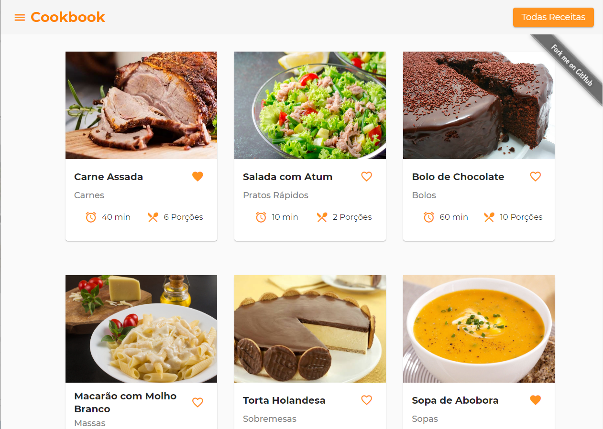

## **My Cookbook**

## `Criei este projeto para aplicar meus conhecimento obtidos na programação front-end.`

---

## 📌**Stack**

- [Angular 10](https://angular.io/)
- [Material Design](https://material.angular.io/)
- [Sass](https://sass-lang.com/)
- [Typecript](https://www.typescriptlang.org/)

### Até o momento o resultado foi esse:

**Home**

