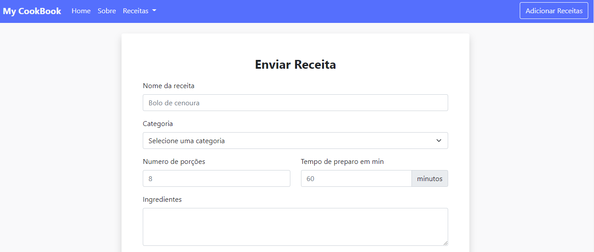
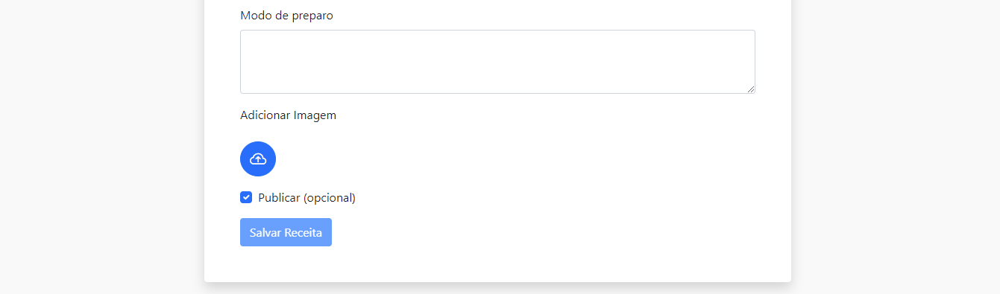
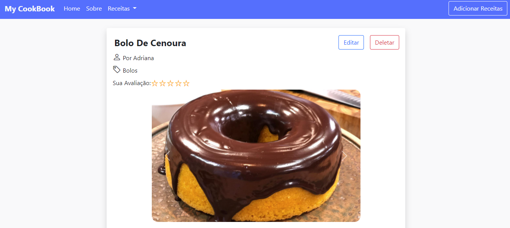
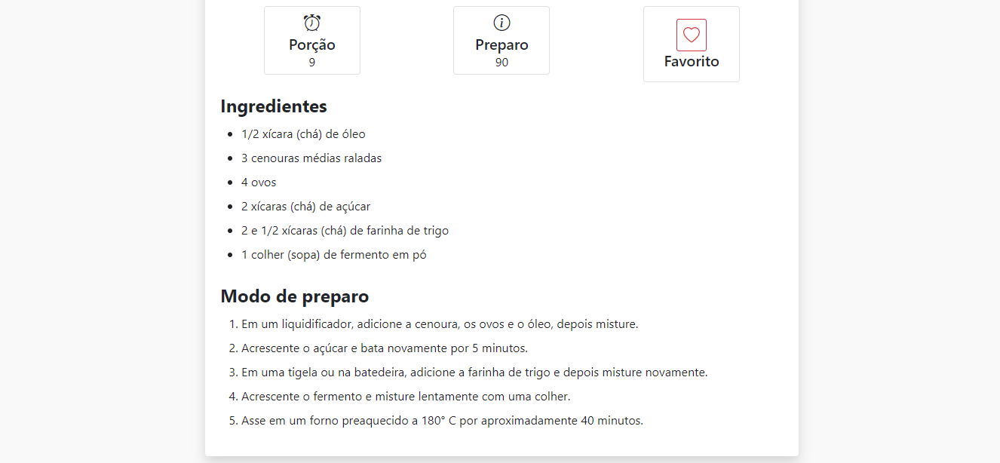

## **My Cookbook**

## `Criei este Pet Project de cadastro de receitas culinárias, para aplicar o que venho estudando como desenvolvedora full stack.`

---

## 📌**Stack Front-end:**

- [Angular 12](https://angular.io/)
- [Bootstrap 5](https://getbootstrap.com/)
- [Ng Bootstrap 10](https://ng-bootstrap.github.io/#/home)
- [TypeScript 4](https://www.typescriptlang.org/)
- [Ngx Toastr 14](https://github.com/scttcper/ngx-toastr)

## 📌**Stack Back-end:**

- [.Net 5](https://dotnet.microsoft.com/)
- [EF 5](https://github.com/dotnet/efcore)
- [ASP.net 5](https://dotnet.microsoft.com/apps/aspnet)
- [SqlServer 5](https://www.microsoft.com/pt-br/sql-server/sql-server-2019)
- [xUnit](https://xunit.net/)

### Este foi o resultado :

🎥 [Vídeo Youtube versão 1](https://www.youtube.com/watch?v=3E-1YAEN120&t=1s)

**Home**

