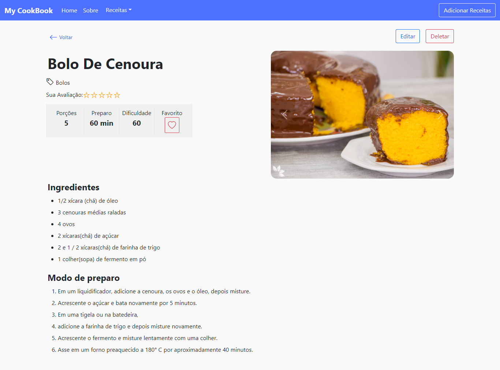
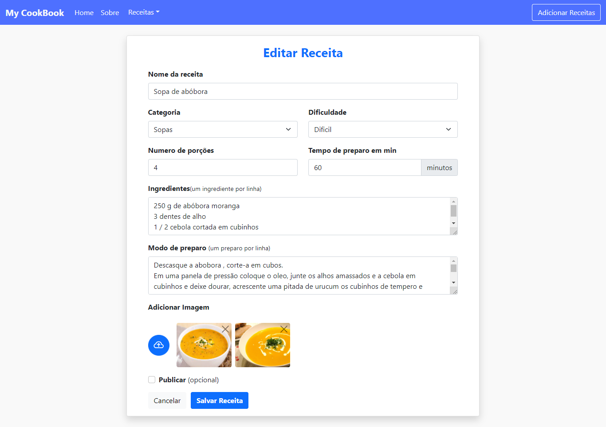
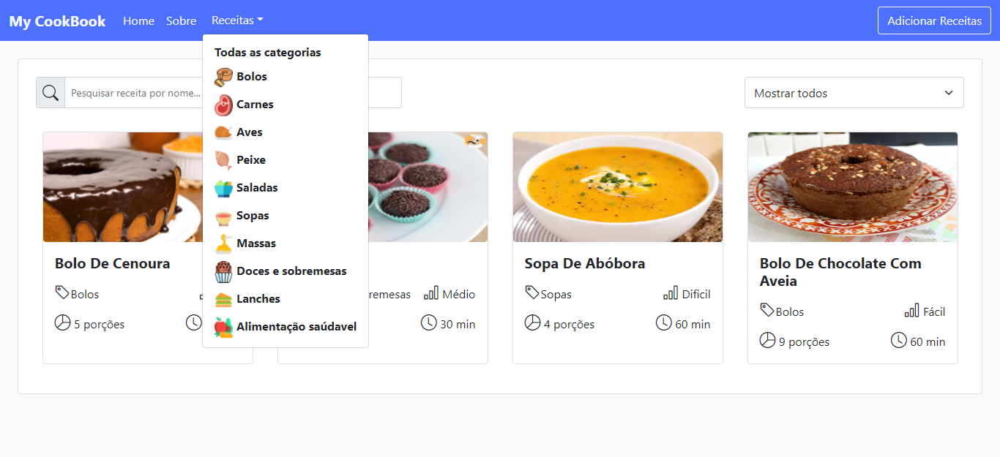
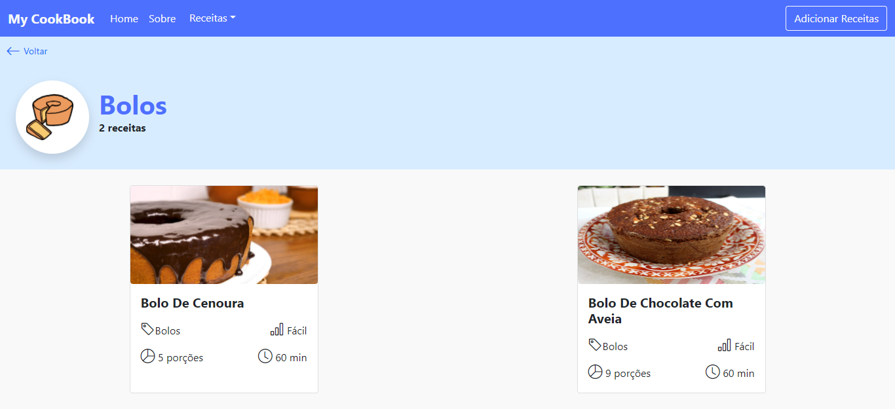

## **My Cookbook**

## `O objetivo é criar uma aplicação de receitas culinárias, a fim de praticar meus conhecimentos no Framework Angular 12 com Bootstrap e Typescript, realizando a comunicação com uma Web API criada em ASP.net.`

 

## üìå**Stack Front-end:**

- [Angular 12](https://angular.io/)
- [Bootstrap 5](https://getbootstrap.com/)
- [Ng Bootstrap 10](https://ng-bootstrap.github.io/#/home)
- [TypeScript 4](https://www.typescriptlang.org/)
- [Ngx Toastr 14](https://github.com/scttcper/ngx-toastr)

## üìå**Stack Back-end:**

- [.Net 5](https://dotnet.microsoft.com/)
- [EF 5](https://github.com/dotnet/efcore)
- [ASP.net 5](https://dotnet.microsoft.com/apps/aspnet)
- [SqlServer 5](https://www.microsoft.com/pt-br/sql-server/sql-server-2019)
- [xUnit](https://xunit.net/)

### 🏷️ **Versão 1**

🎥 [Vídeo Youtube ](https://www.youtube.com/watch?v=3E-1YAEN120&t=1s)

### 🏷️ **Versão 2**

**Diagrama de classe do domínio**

**Home**

**Adicionar receita**

**Ver receita**

**Editar receita**

**Deletar receita**

**Menu drop-down das categorias**

**Todas as categorias**

**Receitas de uma determinada categoria**

